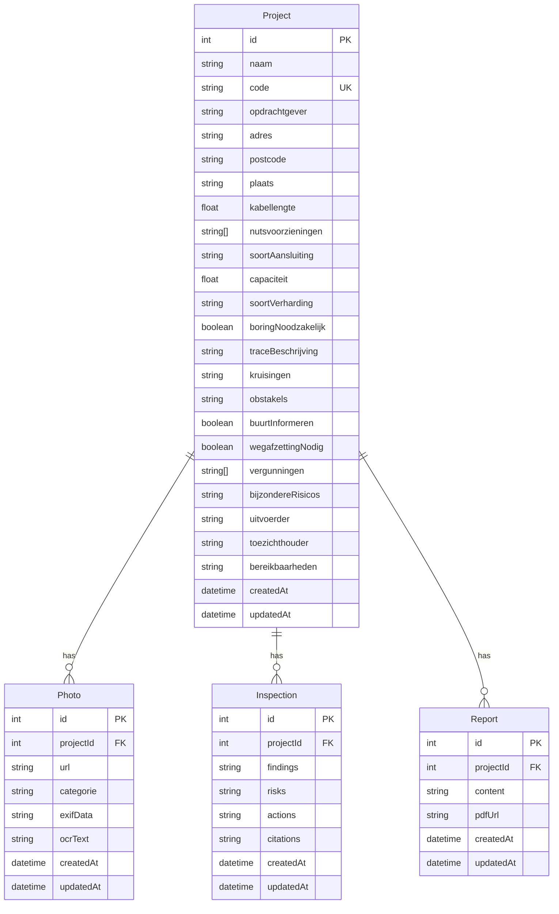

# Schouw Agent

AI-gestuurde schouwrapportage voor Nederlandse nutsvoorzieningen (Liander & Vitens)

## 🎯 Doel

Schouw Agent is een lokale webapp waarmee buitendienstmedewerkers en werkvoorbereiders:

1. **Foto's uploaden** per categorie (meterkast, gebouw, locatie, omgevingssituatie, sleuf, bijzonderheden)
2. **Projectinformatie vastleggen** (algemene gegevens, kabellengte, elektra/gas/water nodig, soort aansluiting, etc.)
3. **Met AI projectdata + foto's interpreteren** t.o.v. actuele eisen/werkinstructies van Liander en Vitens
4. **Gestructureerd schouwrapport genereren** (indeling in paragrafen), waarna de gebruiker het kan bewerken en als PDF kan downloaden

## 🚀 Getting Started

### Vereisten

- Node.js 18+
- pnpm (aanbevolen) of npm
- OpenAI API key

### Installatie

1. **Kloon de repository**
   ```bash
   git clone <repository-url>
   cd schouw-agent
   ```

2. **Installeer dependencies**
   ```bash
   pnpm install
   ```

3. **Configureer environment variabelen**
   ```bash
   cp env.example .env.local
   ```
   
   Vul de volgende variabelen in:
   ```env
   DATABASE_URL="file:./dev.db"
   OPENAI_API_KEY="your_openai_api_key_here"
   NEXTAUTH_URL="http://localhost:3000"
   NEXTAUTH_SECRET="your_nextauth_secret_here"
   ```

4. **Setup database**
   ```bash
   pnpm db:generate
   pnpm db:migrate
   pnpm db:seed
   ```

5. **Start development server**
   ```bash
   pnpm dev
   ```

6. **Open de applicatie**
   ```
   http://localhost:3000
   ```

## 📁 Project Structuur

```
schouw-agent/
├── app/                    # Next.js App Router
│   ├── api/               # API routes
│   │   ├── analyze.ts     # AI-analyse endpoint
│   │   ├── pdf.ts         # PDF generatie
│   │   ├── projects/      # Project CRUD
│   │   ├── report.ts      # Rapport opslaan
│   │   └── upload.ts      # Foto upload
│   ├── projects/          # Project pagina's
│   │   ├── new/           # Nieuw project formulier
│   │   └── [id]/          # Project detail
│   ├── globals.css        # Global styles
│   ├── layout.tsx         # Root layout
│   └── page.tsx           # Dashboard
├── components/             # React componenten
│   ├── ui/                # shadcn/ui componenten
│   ├── ChecklistView.tsx  # AI-analyse resultaten
│   ├── PhotoGrid.tsx      # Foto overzicht
│   ├── PdfButton.tsx      # PDF generatie
│   ├── ReportEditor.tsx   # Rapport editor
│   └── UploadDropzone.tsx # Foto upload
├── lib/                    # Utilities en services
│   ├── checklist.ts        # Liander/Vitens eisen
│   ├── exif.ts            # EXIF data extractie
│   ├── ocr.ts             # OCR tekst extractie
│   ├── openai.ts          # AI-analyse service
│   ├── schema.ts          # Zod validatie schema's
│   └── utils.ts           # Helper functies
├── prisma/                 # Database
│   ├── schema.prisma      # Database schema
│   └── seed.ts            # Demo data
├── __tests__/             # Unit tests
├── tests/e2e/             # E2E tests
└── README.md              # Deze documentatie
```

## 🏗️ Architectuur

### Component Diagram

```
┌─────────────────┐    ┌─────────────────┐    ┌─────────────────┐
│   Frontend      │    │   Backend       │    │   Database      │
│                 │    │                 │    │                 │
│ - Next.js       │    │ - Next.js API   │    │ - SQLite        │
│ - React         │    │ - Prisma ORM    │    │ - Prisma        │
│ - Tailwind CSS  │    │ - OpenAI API    │    │                 │
│ - shadcn/ui     │    │ - pdf-lib       │    │                 │
│ - React Hook    │    │ - exifr         │    │                 │
│   Form          │    │ - Tesseract.js  │    │                 │
│ - Zod           │    │                 │    │                 │
└─────────────────┘    └─────────────────┘    └─────────────────┘
         │                       │                       │
         │                       │                       │
         └───────────────────────┼───────────────────────┘
                                 │
                    ┌─────────────────┐
                    │   AI Service    │
                    │                 │
                    │ - OpenAI GPT-4  │
                    │ - Checklist     │
                    │   Analysis      │
                    └─────────────────┘
```

### Datamodel



## 🤖 AI-analyse

### Checklist Items

De applicatie gebruikt actuele eisen van Liander en Vitens:

### Meterkast (Liander)
- **Afmetingen:** Minimaal 0.6m x 0.4m x 0.2m
- **Toegankelijkheid:** 1.2m vrije ruimte voor meterkast
- **Hoofdschakelaar:** Verplichte hoofdschakelaar in meterkast
- **Ventilatie:** Voldoende ventilatieopeningen aanwezig
- **Aarding:** Correcte aarding aanwezig

### Sleuf en Tracé (Liander)
- **Diepte elektra:** Minimaal 0.6m diepte voor elektrakabels
- **Diepte gas:** Minimaal 0.8m diepte voor gasleidingen
- **Diepte water:** Minimaal 1.0m diepte voor waterleidingen
- **Zandlaag:** 10cm zandlaag boven kabels
- **Markeringstape:** Gele (gas), rode (elektra), blauwe (water) markeringstape
- **Mantelbuis:** Verplicht bij kruisingen

### Watermeter (Vitens)
- **Vorstvrije plaatsing:** Watermeter vorstvrij geïnstalleerd
- **Bereikbaarheid:** Goed bereikbaar voor onderhoud
- **Afsluiters:** Afsluiters aanwezig voor watermeter
- **Terugstroombeveiliging:** Terugslagklep waar van toepassing

### Bronnen (Geraadpleegd op 7 oktober 2025)
- [Liander meterkast richtlijnen](https://www.liander.nl/meterkast/richtlijnen-en-eisen)
- [Liander inmeetvoorwaarden](https://bestekken.liander.nl/qa_faqs/waar-kan-ik-de-meest-actuele-inmeetvoorwaarden-en-aanlevereisen-voor-ondergrondse-revisie-vinden/)
- [Vitens watermeter eisen](https://www.vitens.nl)

## 📋 Gebruikersflows

### 1. Buitendienstmedewerker
1. **Nieuw project aanmaken** → Projectgegevens invullen
2. **Foto's uploaden** → Per categorie (meterkast, gebouw, etc.)
3. **AI-analyse uitvoeren** → Automatische beoordeling tegen eisen
4. **Rapport bekijken** → Resultaten en aanbevelingen
5. **PDF genereren** → Downloadbaar rapport

### 2. Werkvoorbereider
1. **Projecten overzicht** → Alle projecten bekijken
2. **Project details** → Specifiek project analyseren
3. **Rapport bewerken** → Aanpassingen maken
4. **PDF downloaden** → Definitief rapport

### 3. Beheerder
1. **Dashboard** → Overzicht alle projecten
2. **Zoeken/filteren** → Projecten vinden
3. **Rapporten beheren** → PDF's en versies
4. **Systeem status** → AI-analyse en uploads

## 🧪 Testen

### Unit Tests
```bash
pnpm test
```

### E2E Tests
```bash
pnpm test:e2e
```

### Linting
```bash
pnpm lint
```

### Type Checking
```bash
pnpm typecheck
```

## 🔧 Scripts

```bash
# Development
pnpm dev              # Start development server
pnpm build            # Build for production
pnpm start            # Start production server

# Database
pnpm db:generate      # Generate Prisma client
pnpm db:migrate       # Run database migrations
pnpm db:seed          # Seed database with demo data
pnpm db:reset         # Reset database

# Testing
pnpm test             # Run unit tests
pnpm test:e2e         # Run E2E tests
pnpm lint             # Run ESLint
pnpm typecheck        # Run TypeScript check
```

## 🔄 Hoe eisen up-to-date houden

### Workflow voor het bijwerken van eisen:

1. **Browse actuele documentatie**
   - Raadpleeg [Liander documentatie](https://www.liander.nl)
   - Raadpleeg [Vitens documentatie](https://www.vitens.nl)
   - Noteer datum van raadpleging

2. **Update checklist**
   - Bewerk `lib/checklist.ts`
   - Voeg nieuwe items toe
   - Update bestaande normen
   - Verwijder verouderde items

3. **Test wijzigingen**
   ```bash
   pnpm test
   pnpm test:e2e
   ```

4. **Deploy updates**
   - Commit wijzigingen
   - Push naar repository
   - Deploy naar productie

### Voorbeeld checklist update:

```typescript
// lib/checklist.ts
export const LIANDER_CHECKLIST: ChecklistItem[] = [
  {
    id: 'nieuwe-eis-2024',
    category: 'meterkast',
    title: 'Nieuwe meterkast eis 2024',
    norm: 'Minimaal 0.7m x 0.5m x 0.3m', // Updated norm
    description: 'Nieuwe eis voor 2024',
    evidence: 'Meetlintfoto van meterkast',
    priority: 'hoog',
    source: 'Liander meterkast richtlijnen 2024',
    url: 'https://www.liander.nl/meterkast/richtlijnen-en-eisen',
    date: '7 oktober 2025' // Update datum
  }
];
```

## 🚨 Beperkingen

- **Lokale opslag:** SQLite database (kan later naar PostgreSQL)
- **AI-analyse:** Vereist OpenAI API key
- **Foto uploads:** Maximaal 10MB per foto, 50 foto's per project
- **PDF generatie:** Basis functionaliteit (kan uitgebreid worden)
- **Authenticatie:** Eenvoudige lokale sessies (kan uitgebreid worden)

## 📄 Licentie

MIT License - zie [LICENSE](LICENSE) bestand voor details.

## 🤝 Bijdragen

1. Fork de repository
2. Maak een feature branch (`git checkout -b feature/amazing-feature`)
3. Commit je wijzigingen (`git commit -m 'Add amazing feature'`)
4. Push naar de branch (`git push origin feature/amazing-feature`)
5. Open een Pull Request

## 📞 Support

Voor vragen of problemen:
- Open een issue in de repository
- Raadpleeg de documentatie
- Controleer de logs voor foutmeldingen

---

**Schouw Agent** - Professionele schouwrapportage voor Nederlandse nutsvoorzieningen
